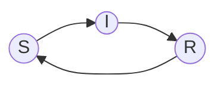

## simsurveillance
Python software for simulating, evaluating, and optimizing modes of disease monitoring.

## Installation
Installation of the software is possible via local pip. Download the files, and install using the following command:
```
pip install -e .
```
To perform the installation with optional support for inference via stan, use the following command:
```
pip install -e .[stan]
```
Note that installing stan on your computer may involve platform-specific requirements and dependencies which are not handled automatically by the pip install.

## Usage
For examples of usage, refer to the [examples](examples/) directory. For the full api documentation, see the [readthedocs](https://epi-analytics-surveillanceproof-of-concept.readthedocs.io/en/latest/).

`simsurveillance` employs compartmental-type models of disease spread (SIRS).



## Software
[](https://github.com/epi-analytics-surveillance/proof-of-concept/actions/workflows/software_testing_unit_os.yml)

[](https://github.com/epi-analytics-surveillance/proof-of-concept/actions/workflows/software_testing_unit_py.yml)

[](https://github.com/epi-analytics-surveillance/proof-of-concept/actions/workflows/software_testing_coverage.yml)

[](https://github.com/epi-analytics-surveillance/proof-of-concept/actions/workflows/software_testing_style.yml)

[](https://epi-analytics-surveillanceproof-of-concept.readthedocs.io/en/latest/?badge=latest)